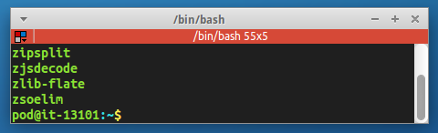

# Greybird-mod
Xubuntu Greybird theme modification for XFCE4:
* gtk2
* gtk3
* xfwm4
* xfce4-notifyd


## Screenshot


* Squared xfwm4 theme
* Simple scrollbars


## Installation
Put greybird-mod directory to your ~/.themes

```bash
THEME=greybird-mod
xfconf-query -c xsettings -p /Net/ThemeName -s $THEME
xfconf-query -c xfwm4 -p /general/theme -s $THEME
xfconf-query -c xfce4-notifyd -p /theme -s $THEME
```
